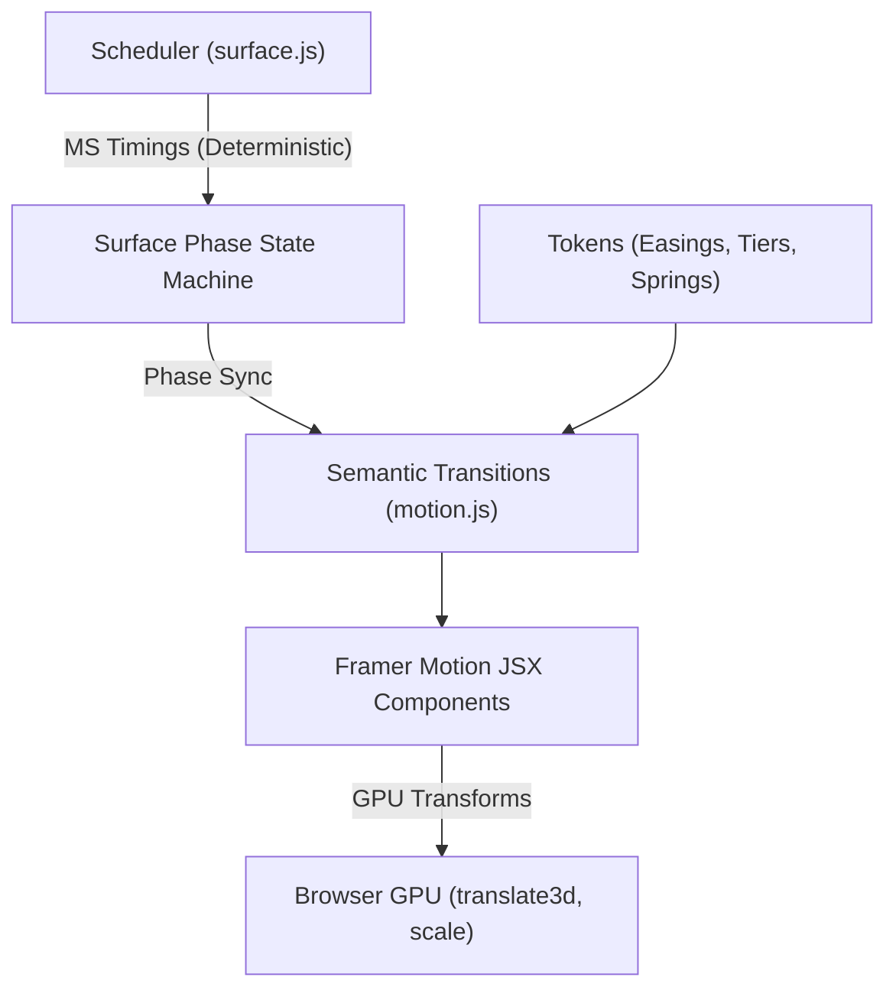

# Nav Modülü Motion Sistemi Dokümantasyonu (`nav_motion.md`)

Bu dokümantasyon, `src/modules/nav` modülündeki hareket (motion) sistemini yalnızca kuramsal tanımları üzerinden değil, **gerçek JSX kullanım noktaları, bileşen hiyerarşisi, state tetikleyicileri ve fiziksel zamanlamaları** üzerinden eksiksiz olarak açıklamaktadır.

---

## İçindekiler

1. [Mimari Genel Bakış ve Temel Prensipler](#1-mimari-genel-bakış-ve-temel-prensipler)
2. [Hızlı Başvuru Matrisi (5 Temel Soru)](#2-hızlı-başvuru-matrisi-5-temel-soru)
3. [Tüm Motion Değerlerinin Ayrıntılı Kataloğu](#3-tüm-motion-değerlerinin-ayrıntılı-kataloğu)
   - [3.1 Foundations & Motion Tokens](#31-foundations--motion-tokens)
   - [3.2 Choreography & Gesture Tokens](#32-choreography--gesture-tokens)
   - [3.3 Semantic Transitions (Geçişler)](#33-semantic-transitions-geçişler)
   - [3.4 Component Variants (Durum Setleri)](#34-component-variants-durum-setleri)
   - [3.5 Dynamic Motion Helpers (Hesaplayıcılar)](#35-dynamic-motion-helpers-hesaplayıcılar)
4. [Dağıtık ve Hard-Coded Animasyon Raporu](#4-dağıtık-ve-hard-coded-animasyon-raporu)
5. [motion.js İsimlendirme, Gruplama ve Eşleştirme Tablosu](#5-motionjs-isimlendirme-gruplama-ve-eşleştirme-tablosu)

---

## 1. Mimari Genel Bakış ve Temel Prensipler

Nav modülünün motion mimarisi; macOS Dock / iOS kart yığını estetiğini, saf JavaScript durum makinesi (state machine scheduler) determinizmi ve Framer Motion GPU donanım hızlandırması ile birleştirir.



### Temel Kurallar:

1. **GPU Hızlandırması ve `toGpuTransform`:**
   Layout reflow (top/left/height gibi reflow maliyetli özellikler) yerine tüm uzaysal hareketler `translate3d(0, y, 0) scale(s)` ile GPU katmanında kompoze edilir. Titremeleri önlemek için `NAV_COMPOSITOR_STYLE` (`backfaceVisibility: hidden`, `WebkitFontSmoothing: antialiased`) kullanılır.
2. **Deterministik Scheduler - Framer Motion Senkronizasyonu:**
   `surface.js` içerisindeki saf transition çekirdeği zamanlamaları milisaniye (`NAV_SURFACE_CHOREOGRAPHY_TIMINGS`) olarak tutar; Framer Motion tween süreleri (`NAV_SURFACE_BODY_ENTER_TRANSITION`, `NAV_ACTION_DISMISS_TRANSITION` vb.) bu milisaniye değerleriyle birebir aynıdır.
3. **Kademeli Zamanlama Hiyerarşisi (`NAV_TIERS`):**
   Mesafe ve süreler `MICRO` (0.24s / 4px), `FAST` (0.44s / 9px), `STANDARD` (0.66s / 18px) ve `SURFACE` (0.96s / 28px) kademelerine göre ölçeklenir.
4. **Merkezi Güvenlik:**
   `motion.js`, tüm hareket sabitlerinin tek doğruluk kaynağıdır (single source of truth). Bileşenler içerisinde rastgele inline duration veya easing yazılmaz.

---

## 2. Hızlı Başvuru Matrisi (5 Temel Soru)

Aşağıdaki tablo, Nav modülündeki tüm motion değerlerinin en sık sorulan 5 sorusunu tek bakışta yanıtlar:

| Motion Değeri                             | 1. Ne İşe Yarıyor?                                                    | 2. Hangi JSX Elementi?                                                      | 3. Nerede Kullanılıyor (Bileşen & Dosya)?                                                                                                                                                                                    | 4. Hangi Durumda Çalışıyor?                                                  | 5. Animasyonun Hangi Bölümünü Kontrol Ediyor?                                                                                      |
| :---------------------------------------- | :-------------------------------------------------------------------- | :-------------------------------------------------------------------------- | :--------------------------------------------------------------------------------------------------------------------------------------------------------------------------------------------------------------------------- | :--------------------------------------------------------------------------- | :--------------------------------------------------------------------------------------------------------------------------------- |
| **`NAV_CARD_HEIGHT_OPEN_TRANSITION`**     | Kart yığınının yüzey açılırken büyümesini sağlar                      | `<motion.div id="nav-card-stack">`                                          | `Nav` ([index.js](file:///Users/omerdlw/Documents/template/src/modules/nav/index.js#L507-L527))                                                                                                                              | `surfacePhase === EXPANDING_BODY \|\| OPEN`                                  | Deste dış kapsayıcısının yükseklik ve genişlik tween geçişi (0.84s APPLE_FLUID - çok yavaş başlayıp hızlanan akış)         |
| **`NAV_CARD_HEIGHT_CLOSE_TRANSITION`**    | Kart yığınının yüzey kapanırken küçülmesini sağlar                    | `<motion.div id="nav-card-stack">`                                          | `Nav` ([index.js](file:///Users/omerdlw/Documents/template/src/modules/nav/index.js#L507-L527))                                                                                                                              | `surfacePhase === COLLAPSING_BODY \|\| RESTORING_HEADER`                     | Deste dış kapsayıcısının yükseklik ve genişlik kapanış geçişi (0.84s APPLE_FLUID)                                                  |
| **`NAV_STACK_TRANSITION`**                | Deste boyutu veya rotası değiştiğinde temel boyut geçişi              | `<motion.div id="nav-card-stack">`                                          | `Nav` ([index.js](file:///Users/omerdlw/Documents/template/src/modules/nav/index.js#L507-L527))                                                                                                                              | Varsayılan kart boyutu değişimleri                                           | Deste konteynerinin normal genişlik/yükseklik/transform tween'i (0.66s SOFT)                                                       |
| **`getNavStackAnimateProps`**             | Deste boyutlarını ve breadcrumb dikey lift ofsetini hesaplar          | `<motion.div id="nav-card-stack">`                                          | `Nav` ([index.js](file:///Users/omerdlw/Documents/template/src/modules/nav/index.js#L519))                                                                                                                                   | Her render / state / viewport ölçümünde                                      | Genişlik, yükseklik, breadcrumbs varken -42px dikey kaydırma (`translate3d(0, -42px, 0)`), fullscreen opaklığı                     |
| **`navBackdropVariants`**                 | Arkaplan karartmasının opaklık durumlarını yönetir                    | `<motion.div key="nav-backdrop">`                                           | `Nav` ([index.js](file:///Users/omerdlw/Documents/template/src/modules/nav/index.js#L492-L504))                                                                                                                              | `isBackdropVisible` (deste genişlediğinde veya yüzey açıldığında)            | Scrim katmanının `opacity: 0 -> 1 -> 0` saf karartma geçişi                                                                        |
| **`NAV_BACKDROP_TRANSITION`**             | Arkaplan karartmasının giriş ve çıkış yumuşaklığını belirler          | `<motion.div key="nav-backdrop">`                                           | `Nav` ([index.js](file:///Users/omerdlw/Documents/template/src/modules/nav/index.js#L498))                                                                                                                                   | Backdrop mount/unmount olurken                                               | Opaklık ve blur tween süresi ve eğrisi (0.84s APPLE_FLUID)                                                                         |
| **`getNavItemAnimateValues`**             | Kartın destedeki derinlik, yığılma ve hover-peek ofsetini verir       | `<motion.div className={cardClassName}>`                                    | `NavCardItem` ([cards.js](file:///Users/omerdlw/Documents/template/src/modules/nav/cards.js#L909-L927))                                                                                                                      | Destedeki her kartın pozisyonu ve stack hover durumunda                      | Destedeki kartların `y`, `scale` ve `opacity` değerleri; hover durumunda mikroskopik yelpazelenme (peek)                           |
| **`getNavItemTransition`**                | Kartın destedeki durumuna uygun geçişi seçer                          | `<motion.div className={cardClassName}>`                                    | `NavCardItem` ([cards.js](file:///Users/omerdlw/Documents/template/src/modules/nav/cards.js#L928-L934))                                                                                                                      | Deste genişlerken, daralırken veya kompakt moddan dönerken                   | Kartın deste içi hareket hızı, gecikmesi (`stagger`) ve easing'i                                                                   |
| **`getNavItemCompactExitValues`**         | Kompakt moda geçerken altta kalan kartları gizler                     | `<motion.div className={cardClassName}>`                                    | `NavCardItem` ([cards.js](file:///Users/omerdlw/Documents/template/src/modules/nav/cards.js#L935-L937))                                                                                                                      | Kompakt moda geçiş (sayfa aşağı kaydırıldığında)                             | Kartların kademeli olarak aşağıya doğru küçülüp kaybolması (0.62s EXIT)                                                            |
| **`getNavItemCompactRestoreValues`**      | Kompakt moddan çıkarken alttaki kartların başlangıç pozisyonunu kurar | `<motion.div className={cardClassName}>`                                    | `NavCardItem` ([cards.js](file:///Users/omerdlw/Documents/template/src/modules/nav/cards.js#L914-L920))                                                                                                                      | Kompakt mod sonlandığında deste restore edilirken                            | Alttaki kartların başlangıç `opacity: 0` ve hafif küçültülmüş scale durumu                                                         |
| **`getNavCardDelay`**                     | Kartların pozisyonuna göre kademeli animasyon gecikmesi üretir        | Dahili helper                                                               | `NavCardItem` ([cards.js](file:///Users/omerdlw/Documents/template/src/modules/nav/cards.js#L899-L907))                                                                                                                      | Deste açılırken (`expanded`) veya hover yapıldığında (`peek`)                | Alttaki kartların sırayla hareket etmesini sağlayan gecikme (`delay`)                                                              |
| **`getNavCardContentAnimateProps`**       | Kart gövdesinin kompakt/deste altında görünürlüğünü yönetir           | `<motion.div ref={cardContentRef}>`                                         | `NavCardItem` ([cards.js](file:///Users/omerdlw/Documents/template/src/modules/nav/cards.js#L987-L995))                                                                                                                      | Kompakt mod veya destede altta kalan kart pozisyonlarında                    | Kart iç içeriğinin `opacity: 0` ve dikey kaydırma ile gizlenmesi / gösterilmesi                                                    |
| **`getNavCardContentTransition`**         | Kart gövdesinin görünürlük geçiş hızını ayarlar                       | `<motion.div ref={cardContentRef}>`                                         | `NavCardItem` ([cards.js](file:///Users/omerdlw/Documents/template/src/modules/nav/cards.js#L996-L999))                                                                                                                      | Kompakt moda girerken veya çıkarken                                          | Kart gövde içeriğinin fade-in / fade-out zamanlaması                                                                               |
| **`navCompactTitleVariants`**             | Kompakt mod tek satır başlık göstergesini animasyonlar                | `<motion.div key="compact-title-overlay">`                                  | `NavCardItem` ([cards.js](file:///Users/omerdlw/Documents/template/src/modules/nav/cards.js#L962-L968))                                                                                                                      | `compact === true`                                                           | Kompakt modda kartın altında gecikmeli beliren başlık yazısı (0.52s, delay: 0.56s)                                                 |
| **`navHeaderSwapVariants`**               | Kart başlığı ile yüzey başlığı arasındaki takas geçişi                | `<motion.div key={headerKey}>` & `<motion.div key="surface-content-layer">` | `NavCardHeader` & `NavCardItem` ([cards.js](file:///Users/omerdlw/Documents/template/src/modules/nav/cards.js#L518, L1011))                                                                                                  | Rota değiştiğinde veya yüzey açıldığında                                     | Eski başlığın yukarı kayarak çıkması (-12px, blur 6px), yeni başlığın netleşerek gelmesi (+16px, blur 6px -> 0px)                 |
| **`NAV_HEADER_SWAP_TRANSITION`**          | Başlık takas tween zamanlamasını kontrol eder                         | `<motion.div>`                                                              | `NavCardHeader` & `NavCardItem` ([cards.js](file:///Users/omerdlw/Documents/template/src/modules/nav/cards.js#L524, L1017))                                                                                                  | Başlık katmanı değiştiğinde                                                  | Başlık katmanının 0.52s APPLE_FLUID geçişi                                                                                         |
| **`navExtensionShelfVariants`**           | Yüzey eklenti rafı (extension shelf) katman geçişi                    | `<motion.div key="extension-shelf-layer">`                                  | `NavCardItem` ([cards.js](file:///Users/omerdlw/Documents/template/src/modules/nav/cards.js#L1026-L1033))                                                                                                                    | `isExtensionShelf === true` (yüzey eklentileri aktifken kart 1 pozisyonunda) | Eklenti barının hafif yukarı kayarak yerleşmesi (0.44s CINEMATIC) ve çıkışı (-6px / 0.32s EXIT)                                    |
| **`navHeaderRestoreVariants`**            | Yüzey kapandığında standart kart başlığını geri yükler                | `<motion.div key="standard-content-layer">`                                 | `NavCardItem` ([cards.js](file:///Users/omerdlw/Documents/template/src/modules/nav/cards.js#L1041-L1048))                                                                                                                    | Yüzeyden standart karta dönüşte (2. faz)                                     | Standart başlığın `blur(6px)`'den netleşerek yerine süzülmesi (-16px -> 0 / 0.52s APPLE_FLUID)                                     |
| **`getNavDescriptionVariants`**           | Kart açıklama metninin dinamik opaklık ve geçişini sağlar             | `<motion.p key={text}>`                                                     | `NavDescription` ([cards.js](file:///Users/omerdlw/Documents/template/src/modules/nav/cards.js#L113-L121))                                                                                                                   | Açıklama metni değiştiğinde                                                  | Metnin dikey kayarak fade-in (+8px -> 0) ve fade-out (-5px) olması                                                                 |
| **`navFadeVariants`**                     | Kart başlığı ve standart içerik için dikey GPU slide-fade             | `<motion.h3 key={text}>` & `<motion.div key="nav-standard-content">`        | `NavTitle` & `StandardItemContent` ([cards.js](file:///Users/omerdlw/Documents/template/src/modules/nav/cards.js#L283, L642))                                                                                                | Başlık metni değiştiğinde veya HUD kapanıp içerik döndüğünde                 | Başlık/içeriğin +12px'den 0'a girmesi, -8px'e çıkması                                                                              |
| **`navIconVariants`**                     | Kart ikonunun yumuşak ölçekli giriş ve çıkışı                         | `<motion.div key={iconKey}>`                                                | `NavIcon` ([cards.js](file:///Users/omerdlw/Documents/template/src/modules/nav/cards.js#L232-L242))                                                                                                                          | Rota veya medya oynatma durumuna göre ikon değiştiğinde                      | İkonun `scale: 0.88 -> 1 -> 0.88` ölçeklenmesi ve opaklığı                                                                         |
| **`NAV_ICON_TRANSITION`**                 | İkon geçişinin süre ve eğrisini kontrol eder                          | `<motion.div>`                                                              | `NavIcon` ([cards.js](file:///Users/omerdlw/Documents/template/src/modules/nav/cards.js#L238))                                                                                                                               | İkon mount/unmount olurken                                                   | 0.48s SOFT tween geçişi                                                                                                            |
| **`navBadgeVariants`**                    | Rozet (badge) bildirimlerinin pop-in ölçek animasyonu                 | `<motion.div>` & `<motion.span>`                                            | `Badge`, `NavIconOverlay`, `NavCommand` ([cards.js](file:///Users/omerdlw/Documents/template/src/modules/nav/cards.js#L170, L380), [commands.js](file:///Users/omerdlw/Documents/template/src/modules/nav/commands.js#L149)) | Rozet sayısı güncellendiğinde veya belirdiğinde                              | `scale: 0.78 -> 1 -> 0.82` yaylanarak sıçrama                                                                                      |
| **`NAV_BADGE_TRANSITION`**                | Rozet yay (spring) dinamiğini yönetir                                 | `<motion.div>` & `<motion.span>`                                            | `Badge`, `NavIconOverlay`, `NavCommand`                                                                                                                                                                                      | Rozet mount/update anında                                                    | Yaylanma fiziği: stiffness 360, damping 20, mass 0.42                                                                              |
| **`navHudVariants`**                      | HUD gösterge paneli giriş ve çıkış durumu                             | `<motion.div key="nav-hud:...">`                                            | `StandardItemContent` ([cards.js](file:///Users/omerdlw/Documents/template/src/modules/nav/cards.js#L629-L640))                                                                                                              | `isTop && isHudActive` (işlem devam ederken veya HUD kaydolduğunda)          | Kartın HUD paneline sinematik dönüşümü (+14px -> 0)                                                                                |
| **`NAV_HUD_TRANSITION`**                  | HUD paneli geçiş tween süresi                                         | `<motion.div>`                                                              | `StandardItemContent` ([cards.js](file:///Users/omerdlw/Documents/template/src/modules/nav/cards.js#L635))                                                                                                                   | HUD açılırken                                                                | 0.66s CINEMATIC geçiş                                                                                                              |
| **`navActionDismissVariants`**            | Kart altındaki eylem butonunun yüzey açılırken kaybolması             | `<motion.div key="nav-action-component-dismiss">`                           | `NavCardItem` ([cards.js](file:///Users/omerdlw/Documents/template/src/modules/nav/cards.js#L843-L857))                                                                                                                      | `surfacePhase === DISMISSING_ACTION`                                         | Eylem butonlarının yukarı kayarak hızla silinmesi (-8px / 0.26s EXIT)                                                              |
| **`NAV_ACTION_DISMISS_TRANSITION`**       | Eylem butonu çıkış tween'i                                            | `<motion.div>`                                                              | `NavCardItem` ([cards.js](file:///Users/omerdlw/Documents/template/src/modules/nav/cards.js#L849))                                                                                                                           | Yüzey açılışının 1. fazında                                                  | 0.26s EXIT tween (Choreography `ACTION_DISMISS_MS` ile eşleşir)                                                                    |
| **`textCrossfadeVariants`**               | Durum eylemleri ve kart footer butonları için crossfade               | `<motion.div>`                                                              | `ErrorActions`, `GuardActions`, `NavCardItem` ([status.js](file:///Users/omerdlw/Documents/template/src/modules/nav/status.js#L44, L94), [cards.js](file:///Users/omerdlw/Documents/template/src/modules/nav/cards.js#L859)) | Hata veya guard durumu oluştuğunda; normal eylem butonu renderında           | Buton grubunun +8px'den 0'a yumuşak kayarak belirmesi                                                                              |
| **`NAV_FADE_TRANSITION`**                 | Durum butonlarının geçiş tween'i                                      | `<motion.div>`                                                              | `ErrorActions`, `GuardActions`, `NavCardItem`                                                                                                                                                                                | Durum butonları render edilirken                                             | 0.66s EMPHASIZED geçiş                                                                                                             |
| **`navCommandBarSwapVariants`**           | Komut butonlarının yatay sıralı girişi                                | `<motion.div layout="position">`                                            | `NavCommandBar` ([commands.js](file:///Users/omerdlw/Documents/template/src/modules/nav/commands.js#L186-L196))                                                                                                              | Rota veya bağlam komutları güncellendiğinde                                  | Sağdan sola kayma (+12px -> 0), index bazlı kademeli gecikme (stagger)                                                             |
| **`navBreadcrumbsVariants`**              | Breadcrumbs kartının yukarıdan düşüşü                                 | `<motion.div>`                                                              | `NavBreadcrumbsCard` ([breadcrumbs.js](file:///Users/omerdlw/Documents/template/src/modules/nav/breadcrumbs.js#L238-L248))                                                                                                   | `breadcrumbs.length > 1` (alt rotalarda)                                     | Konteynerin -10px'den 0'a inmesi ve -6px'e çıkması                                                                                 |
| **`NAV_BREADCRUMBS_TRANSITION`**          | Breadcrumbs açılış geçişi                                             | `<motion.div>`                                                              | `NavBreadcrumbsCard` ([breadcrumbs.js](file:///Users/omerdlw/Documents/template/src/modules/nav/breadcrumbs.js#L243))                                                                                                        | Breadcrumbs kartı mount olurken                                              | 0.57s EMPHASIZED geçiş                                                                                                             |
| **`navSoundwaveBarVariants`**             | Medya ses dalgası equalizer çubukları                                 | `<motion.span>`                                                             | `NavSoundwave` ([media.js](file:///Users/omerdlw/Documents/template/src/modules/nav/media.js#L83-L90))                                                                                                                       | `isPlaying === true` / `false`                                               | Çubukların sonsuz döngüde farklı fazlarla yükselip alçalması / duraklayınca düzleşmesi                                             |
| **`getNavActionMotionProps`**             | Medya ses hapı (pill) için basılma props paketi                       | `<motion.div>`                                                              | `NavMediaControls` ([media.js](file:///Users/omerdlw/Documents/template/src/modules/nav/media.js#L338-L341))                                                                                                                 | Kullanıcı ses kontrol hapına dokunduğunda/tıkladığında                       | Dokunma anında `scale: 0.98` yaylanması (`NAV_BUTTON_TRANSITION`)                                                                  |
| **`getNavMediaVolumeThumbAnimateProps`**  | Ses kaydırıcı tutamacının sürükleme durumunu yönetir                  | `<motion.div ref={volumeThumbRef}>`                                         | `NavMediaControls` ([media.js](file:///Users/omerdlw/Documents/template/src/modules/nav/media.js#L404-L414))                                                                                                                 | `isDraggingVolume === true` / `false`                                        | Tutamacın sürüklenirken `scale: 1.25` ve beyaz parlama (glow) alması                                                               |
| **`navScrubberTooltipVariants`**          | Video zaman çizelgesi hover tooltip animasyonu                        | `<motion.div>`                                                              | `NavMediaScrubber` ([media.js](file:///Users/omerdlw/Documents/template/src/modules/nav/media.js#L616-L628))                                                                                                                 | `isHovered && showTimeOnHover`                                               | Tooltip kutusunun +8px'den 0'a pop-in olması                                                                                       |
| **`NAV_SCRUBBER_TOOLTIP_SPRING`**         | Tooltip'in fare imlecini takip etme fiziği                            | `useSpring(hoverX, ...)`                                                    | `NavMediaScrubber` ([media.js](file:///Users/omerdlw/Documents/template/src/modules/nav/media.js#L477))                                                                                                                      | Fare scrubber üzerinde gezdirilirken                                         | Fizik yay: damping 28, stiffness 350                                                                                               |
| **`navSurfaceBodyVariants`**              | Açılan görev yüzeyinin (surface) gövde animasyonu                     | `<motion.div key="surface-body-motion">`                                    | `NavSurfaceShell` ([surface.js](file:///Users/omerdlw/Documents/template/src/modules/nav/surface.js#L2705-L2722))                                                                                                            | `surfacePhase === EXPANDING_BODY \|\| OPEN \|\| COLLAPSING_BODY`             | Gövdenin +20px ve `blur(10px)`'den netleşerek açılması (0.84s APPLE_FLUID) ve kapanışta kademeli 1. faz olarak +24px, `blur(8px)` ile kaybolması (0.32s APPLE_FLUID) |
| **`NAV_SURFACE_BODY_ENTER_TRANSITION`**   | Yüzey gövde açılış geçişi                                             | `<motion.div key="surface-body-motion">`                                    | `NavSurfaceShell` ([surface.js](file:///Users/omerdlw/Documents/template/src/modules/nav/surface.js#L2714))                                                                                                                  | Yüzey açılırken (faz 2)                                                      | 0.84s APPLE_FLUID geçiş (`BODY_ENTER_MS: 840` ile senkron, kademeli ivmelenme)                                                    |
| **`NAV_SURFACE_BODY_EXIT_TRANSITION`**    | Yüzey gövde kapanış geçişi                                            | `<motion.div key="surface-body-motion">`                                    | `NavSurfaceShell` ([surface.js](file:///Users/omerdlw/Documents/template/src/modules/nav/surface.js#L2713))                                                                                                                  | Yüzey kapanırken (kademeli 1. faz)                                           | 0.32s APPLE_FLUID geçiş (`BODY_EXIT_MS: 320` ile senkron, eşitlenmiş Apple fluid eğrisi)                                            |
| **`NAV_SURFACE_RESIZE_TRANSITION`**       | Yüzey açıkken dinamik içerik/sekme yükseklik morph geçişi             | `<motion.div id="nav-card-stack">`                                          | `NavCardStack` ([index.js](file:///Users/omerdlw/Documents/template/src/modules/nav/index.js#L503))                                                                                                                           | Yüzey açıkken (`surfacePhase === OPEN`) içerik boyutu değiştiğinde           | 0.58s FLUID_RESIZE geçiş (`[0.32, 0.12, 0.18, 1]`, ölü bölge beklemesi olmadan anında başlayan, kademeli süzülen ipeksi akış)   |
| **`NAV_SURFACE_BODY_STEP_TRANSITION`**    | Yüzey açıkken alt sekme içeriklerinin giriş geçişi                    | `<motion.div key="surface-body-motion">`                                    | `NavSurfaceShell` ([surface.js](file:///Users/omerdlw/Documents/template/src/modules/nav/surface.js#L2743))                                                                                                                  | Yüzey açıkken alt sekme mount olduğunda                                      | 0.54s FLUID_RESIZE geçiş (yükseklik süzülmesiyle tam 1:1 kilitli senkron pürüzsüz giriş)                                            |
| **`navSurfaceControlsContainerVariants`** | Yüzey kontrol butonları konteyner geçişi                              | `<motion.div key="nav-surface-controls-container">`                         | `NavSurfaceControls` ([surface.js](file:///Users/omerdlw/Documents/template/src/modules/nav/surface.js#L2497-L2506))                                                                                                         | `isBodyVisible && (hasClose \|\| hasBack \|\| hasHeaderAction)`              | Konteynerin `targetY` konumuna yerleşmesi (0.44s APPLE_FLUID) ve çıkışı                                                             |
| **`navSurfaceControlsActionVariants`**    | Yüzey özel eylem butonunun girişi                                     | `<motion.div key="nav-surface-custom-action">`                              | `NavSurfaceControls` ([surface.js](file:///Users/omerdlw/Documents/template/src/modules/nav/surface.js#L2509-L2519))                                                                                                         | `hasHeaderAction === true`                                                   | Butonun `blur(4px)`'den netleşerek girişi (0.28s APPLE_FLUID)                                                                      |
| **`navSurfaceControlsBackVariants`**      | Yüzey geri butonunun girişi                                           | `<motion.div key="nav-surface-back">`                                       | `NavSurfaceControls` ([surface.js](file:///Users/omerdlw/Documents/template/src/modules/nav/surface.js#L2522-L2543))                                                                                                         | `hasBack === true`                                                           | Butonun `blur(4px)`'den netleşerek girişi (0.32s APPLE_FLUID)                                                                      |
| **`navSurfaceControlsCloseVariants`**     | Yüzey kapatma butonunun girişi                                        | `<motion.div key="nav-surface-close">`                                      | `NavSurfaceControls` ([surface.js](file:///Users/omerdlw/Documents/template/src/modules/nav/surface.js#L2546-L2567))                                                                                                         | `hasClose === true`                                                          | Butonun `blur(4px)`'den netleşerek pop-in girişi (0.32s APPLE_FLUID)                                                               |
| **`NAV_SURFACE_DRAG`**                    | Yüzey aşağı kaydırarak kapatma jest sabitleri                         | `<motion.section role="dialog">`                                            | `NavSurfaceShell` ([surface.js](file:///Users/omerdlw/Documents/template/src/modules/nav/surface.js#L2652-L2684))                                                                                                            | Açık yüzey üzerinde aşağı sürükleme yapıldığında                             | `dragConstraints`, `dragElastic`, `THRESHOLDS` (65px, 400px/s) ve `INTERPOLATION` ([0, 180] -> opacity [1, 0.75], scale [1, 0.96]) |

---

## 3. Tüm Motion Değerlerinin Ayrıntılı Kataloğu

### 3.1 Foundations & Motion Tokens

#### `NAV_EASINGS`

- **Tanım:**
  ```javascript
  export const NAV_EASINGS = Object.freeze({
    APPLE_FLUID: Object.freeze([0.82, 0, 0.18, 1]),
    PROGRESSIVE_EXIT: Object.freeze([0.75, 0, 0.85, 0.2]),
    CINEMATIC: Object.freeze([0.76, 0, 0.24, 1]),
    EMPHASIZED: Object.freeze([0.16, 1, 0.3, 1]),
    SOFT: Object.freeze([0.22, 1, 0.36, 1]),
    EXIT: Object.freeze([0.7, 0, 0.84, 0]),
  });
  ```
- **Kullanım:** Tüm tween geçişlerinin temel ivmelenme eğrilerini oluşturur.
- **Teknik Amaç:** Fiziksel ve sinematik olarak doğal hissettiren eğriler sunar:
  - `APPLE_FLUID`: Apple fluid arayüz algoritması. Başlangıcı son derece yavaş ve eylemsizdir ("very slow -> slow -> normal -> fast"), ardından hedefe kritik sönümleme ile yağ gibi oturur. Yüzey açılış/kapanış, başlık takası ve backdrop için kullanılır.
  - `PROGRESSIVE_EXIT`: Çıkış/kapanış hareketinde sıfır ani sarsıntı ile başlayıp kademeli hızlanan pürüzsüz terk etme eğrisi.
  - `CINEMATIC`: Vurgulu sahne geçişleri.
  - `EMPHASIZED`: Hızlı mikro tepkiler.
  - `SOFT`: Nazik liste/kart geçişleri.
  - `EXIT`: Standart kapanış eğrisi.

#### `NAV_TIERS`

- **Tanım:**
  ```javascript
  export const NAV_TIERS = Object.freeze({
    MICRO: {
      duration: 0.24,
      distance: 4,
      scaleDelta: 0.008,
      ease: NAV_EASINGS.EMPHASIZED,
    },
    FAST: {
      duration: 0.44,
      distance: 9,
      scaleDelta: 0.012,
      ease: NAV_EASINGS.EMPHASIZED,
    },
    STANDARD: {
      duration: 0.66,
      distance: 18,
      scaleDelta: 0.018,
      ease: NAV_EASINGS.SOFT,
    },
    SURFACE: {
      duration: 0.96,
      distance: 28,
      scaleDelta: 0.024,
      ease: NAV_EASINGS.CINEMATIC,
    },
  });
  ```
- **Kullanım:** `buildVariants` fonksiyonu, `NAV_STACK_TRANSITION`, `NAV_CARD_TRANSITION`, `NAV_FADE_TRANSITION` ve deste derinlik hesaplamaları tarafından kullanılır.
- **Teknik Amaç:** Elemanın boyutuna ve hareket ettiği mesafeye göre süre ve ölçek oranlarını sistematik olarak belirler. `MICRO.distance: 12` ve `scaleDelta: 0.018`, deste hover-peek yelpazelenmesinde tatmin edici ve belirgin bir dokunma hissi sağlar.

#### `NAV_SPRINGS`

- **Tanım:**
  ```javascript
  export const NAV_SPRINGS = Object.freeze({
    PRESS: { type: "spring", stiffness: 480, damping: 32, mass: 0.3 },
    BADGE: { type: "spring", stiffness: 360, damping: 20, mass: 0.42 },
    DECK: { type: "spring", stiffness: 240, damping: 28, mass: 0.85 },
    PEEK: { type: "spring", stiffness: 260, damping: 26, mass: 0.8 },
    SCRUBBER_TOOLTIP: { damping: 28, stiffness: 350 },
  });
  ```
- **Kullanım:**
  - `PRESS`: Buton ve kart basma (`whileTap`) tepkilerinde (NAV_TAP_SCALE: 0.96).
  - `BADGE`: `NAV_BADGE_TRANSITION` üzerinden bildirim rozetlerinde.
  - `DECK` & `PEEK`: Deste fizik modellemesinde; `PEEK` kritik sönümlüdür (damping 1.0 eşdeğeri, sıfır aşma/overshoot).
  - `SCRUBBER_TOOLTIP`: Video scrubber imleç takibinde.
- **Teknik Amaç:** Gerçekçi kütle, sertlik ve sönümleme fiziği ile arayüze dokunsallık kazandırır.

#### `NAV_STAGGER_TIMINGS` & `NAV_STAGGER_DELAY`

- **Tanım:**
  ```javascript
  export const NAV_STAGGER_TIMINGS = Object.freeze({
    EXPAND: 0.068,
    COLLAPSE: 0.052,
    PEEK: 0.078,
    STANDARD: 0.06,
    FAST: 0.042,
  });
  export const NAV_STAGGER_DELAY = NAV_STAGGER_TIMINGS.STANDARD;
  ```
- **Kullanım:** `getNavCardDelay`, `getNavItemTransition`, `getNavItemCompactExitValues`, `navListItemVariants`.
- **Teknik Amaç:** Liste ve deste elemanlarının aynı anda değil, dalga efektiyle sıralı hareket etmesini sağlar.

---

### 3.2 Choreography & Gesture Tokens

#### `NAV_SURFACE_CHOREOGRAPHY_TIMINGS`

- **Tanım:**
  ```javascript
  export const NAV_SURFACE_CHOREOGRAPHY_TIMINGS = Object.freeze({
    ACTION_DISMISS_MS: 260,
    ACTION_DISMISS_SETTLE_MS: 100,
    HEADER_SWAP_MS: 0,
    HEADER_SWAP_SETTLE_MS: 0,
    BODY_ENTER_MS: 840,
    BODY_EXIT_MS: 620,
    BODY_COLLAPSE_SETTLE_MS: 140,
    HEADER_RESTORE_MS: 0,
    RESTORE_SETTLE_MS: 0,
  });
  ```
- **Kullanım:** `src/modules/nav/surface.js` içerisindeki durum makinesi zamanlayıcısında (`createScheduledTransition`).
- **İlişki:**
  - `ACTION_DISMISS_MS` (260ms) -> `NAV_ACTION_DISMISS_TRANSITION` (0.26s)
  - `BODY_ENTER_MS` (840ms) -> `NAV_SURFACE_BODY_ENTER_TRANSITION` ve `NAV_CARD_HEIGHT_OPEN_TRANSITION` (0.84s)
  - `BODY_EXIT_MS` (320ms) -> `NAV_SURFACE_BODY_EXIT_TRANSITION` (0.32s, yüzey içeriğinin aşağı kayıp kaybolması)
  - `HEADER_RESTORE_MS` (520ms) -> `NAV_HEADER_SWAP_TRANSITION` ve kart yüksekliği kapanışının tamamlanması (toplam 840ms / 0.84s APPLE_FLUID)
- **Teknik Amaç:** State Machine faz geçişlerini Framer Motion animasyonlarının tamamlanma anıyla milisaniye hassasiyetinde senkronize tutar.

#### `NAV_SURFACE_DRAG` (`CONSTRAINTS`, `ELASTIC`, `THRESHOLDS`, `INTERPOLATION`)

- **Tanım:**
  ```javascript
  export const NAV_SURFACE_DRAG_CONSTRAINTS = Object.freeze({
    top: 0,
    bottom: 0,
  });
  export const NAV_SURFACE_DRAG_ELASTIC = Object.freeze({
    top: 0.05,
    bottom: 0.5,
  });
  export const NAV_SURFACE_DRAG_THRESHOLDS = Object.freeze({
    DISMISS_OFFSET_Y: 65,
    DISMISS_VELOCITY_Y: 400,
  });
  export const NAV_SURFACE_DRAG_INTERPOLATION = Object.freeze({
    DRAG_RANGE: Object.freeze([0, 180]),
    OPACITY_RANGE: Object.freeze([1, 0.75]),
    SCALE_RANGE: Object.freeze([1, 0.96]),
  });
  ```
- **Kullanıldığı Yer:** `src/modules/nav/surface.js:2621-2681` (`NavSurfaceShell`).
- **Teknik Amaç:** Yüzeyin aşağı sürüklenerek kapatılması sırasındaki rubber-band elastikliğini, sürükleme mesafesine bağlı opaklık/ölçek değişimini ve kapatma tetikleme eşiklerini (65px mesafe veya 400px/s hız) yönetir.

---

### 3.3 Semantic Transitions (Geçişler)

#### `NAV_CARD_HEIGHT_OPEN_TRANSITION` & `NAV_CARD_HEIGHT_CLOSE_TRANSITION`

- **Tanım:**
  ```javascript
  export const NAV_CARD_HEIGHT_OPEN_TRANSITION = Object.freeze({
    type: "tween",
    duration: 0.84,
    ease: NAV_EASINGS.APPLE_FLUID,
  });
  export const NAV_CARD_HEIGHT_CLOSE_TRANSITION = Object.freeze({
    type: "tween",
    duration: 0.84,
    ease: NAV_EASINGS.APPLE_FLUID,
  });
  ```
- **Kullanıldığı JSX:** `<motion.div id="nav-card-stack">` (`transition={navStackTransition}`)
- **Dosya:** [src/modules/nav/index.js:526](file:///Users/omerdlw/Documents/template/src/modules/nav/index.js#L526)
- **Tetikleyici Durum:** Yüzey açılırken (`EXPANDING_BODY` / `OPEN`) veya kapanırken (`COLLAPSING_BODY` / `RESTORING_HEADER`).
- **Teknik Amaç:** Kart destesinin genel genişlik ve yüksekliğinin Apple fluid ivmelenmesi (`very slow -> slow -> normal -> fast`) ile büyümesini ve küçülmesini sağlar.

#### `NAV_SURFACE_BODY_ENTER_TRANSITION` & `NAV_SURFACE_BODY_EXIT_TRANSITION`

- **Tanım:**
  ```javascript
  export const NAV_SURFACE_BODY_ENTER_TRANSITION = Object.freeze({
    type: "tween",
    duration: 0.84,
    ease: NAV_EASINGS.APPLE_FLUID,
  });
  export const NAV_SURFACE_BODY_EXIT_TRANSITION = Object.freeze({
    type: "tween",
    duration: 0.32,
    ease: NAV_EASINGS.APPLE_FLUID,
  });
  ```
- **Kullanıldığı JSX:** `<motion.div key="surface-body-motion">` (`transition={...}`)
- **Dosya:** [src/modules/nav/surface.js:2711](file:///Users/omerdlw/Documents/template/src/modules/nav/surface.js#L2711)
- **Tetikleyici Durum:** Yüzey gövde içeriği mount/unmount olurken.
- **Teknik Amaç:** Yüzey açılırken içeriğin dikey translate (+20px -> 0) ve optik netleşme (`filter: blur(10px) -> blur(0px)`) hareketini `APPLE_FLUID` eğrisiyle (0.84s); kapanırken ise 1. aşama olarak içeriğin eşitlenmiş Apple fluid eğrisiyle aşağı süzülüp (+24px -> 0 opacity) ve yumuşakça bulanıklaşmasını (`blur(8px)`) 0.32s'de tamamlar; ardından 2. aşamada standart başlık geri yüklenir ve kart toplam 0.84s'de (`APPLE_FLUID`) 72px'e kapanır.

#### `NAV_SURFACE_RESIZE_TRANSITION`

- **Tanım:**
  ```javascript
  export const NAV_SURFACE_RESIZE_TRANSITION = Object.freeze({
    type: "tween",
    duration: 0.58, // Ölü bölge beklemesi olmadan anında başlayan ve ipeksi yavaşlayan akış
    ease: NAV_EASINGS.FLUID_RESIZE, // [0.32, 0.12, 0.18, 1]
    height: {
      type: "tween",
      duration: 0.58,
      ease: NAV_EASINGS.FLUID_RESIZE,
    },
    width: {
      type: "tween",
      duration: 0.58,
      ease: NAV_EASINGS.FLUID_RESIZE,
    },
  });
  ```
- **Kullanıldığı JSX:** `<motion.div id="nav-card-stack">` (`transition={navStackTransition}`)
- **Dosya:** [src/modules/nav/index.js:503](file:///Users/omerdlw/Documents/template/src/modules/nav/index.js#L503)
- **Tetikleyici Durum:** Yüzey açıkken (`surfacePhase === NAV_SURFACE_PHASE.OPEN`) sekme/menü geçişi, form büyümesi/küçülmesi veya akordeon açılması durumunda.
- **Teknik Amaç:** `APPLE_FLUID`'ın ilk 350ms'deki boşluk yaratan ölü bölgesini ve agresif drawer eğrisinin ani çakılmasını ortadan kaldırır. `[0.32, 0.12, 0.18, 1]` Apple Fluid Morph eğrisi ile ilk kareden itibaren yumuşakça harekete başlar (boşluk beklemesi sıfırlanır), 0.58 saniyede yağ gibi akarak kart konteynerini yeni boyuta pürüzsüzce oturtur.

#### `NAV_SURFACE_BODY_STEP_TRANSITION`

- **Tanım:**
  ```javascript
  export const NAV_SURFACE_BODY_STEP_TRANSITION = Object.freeze({
    type: "tween",
    duration: 0.54, // Yüzey yükseklik süzülmesiyle kilitli 1:1 senkron
    ease: NAV_EASINGS.FLUID_RESIZE, // [0.32, 0.12, 0.18, 1]
  });
  ```
- **Kullanıldığı JSX:** `<motion.div key="surface-body-motion">` (`transition={...}`)
- **Dosya:** [src/modules/nav/surface.js:2743](file:///Users/omerdlw/Documents/template/src/modules/nav/surface.js#L2743)
- **Tetikleyici Durum:** Yüzey zaten açıkken (`surfacePhase === NAV_SURFACE_PHASE.OPEN`) alt sekmelerin mount olması anında.
- **Teknik Amaç:** Yeni sekmenin içeriğinin konteyner süzülmesiyle tam 1:1 senkron olarak 0.54 saniyede `FLUID_RESIZE` eğrisiyle netleşerek yerine oturmasını sağlar.

#### `NAV_ACTION_DISMISS_TRANSITION`

- **Tanım:**
  ```javascript
  export const NAV_ACTION_DISMISS_TRANSITION = Object.freeze({
    type: "tween",
    duration: 0.26,
    ease: NAV_EASINGS.EXIT,
  });
  ```
- **Kullanıldığı JSX:** `<motion.div key="nav-action-component-dismiss">` (`transition={NAV_ACTION_DISMISS_TRANSITION}`)
- **Dosya:** [src/modules/nav/cards.js:849](file:///Users/omerdlw/Documents/template/src/modules/nav/cards.js#L849)
- **Tetikleyici Durum:** `link.surfacePhase === NAV_SURFACE_PHASE.DISMISSING_ACTION`.
- **Teknik Amaç:** Bir karta ait aksiyon butonuna tıklandığında, yüzey gövdesi açılmadan önce butonların 260 milisaniyede hızla kaybolmasını sağlar.

#### `NAV_HEADER_SWAP_TRANSITION`

- **Tanım:**
  ```javascript
  export const NAV_HEADER_SWAP_TRANSITION = Object.freeze({
    type: "tween",
    duration: 0.52,
    ease: NAV_EASINGS.APPLE_FLUID,
  });
  ```
- **Kullanıldığı JSX:**
  - `<motion.div key={headerKey}>` ([cards.js:524](file:///Users/omerdlw/Documents/template/src/modules/nav/cards.js#L524))
  - `<motion.div key="surface-content-layer">` ([cards.js:1017](file:///Users/omerdlw/Documents/template/src/modules/nav/cards.js#L1017))
  - `<motion.div key="extension-shelf-layer">` ([cards.js:1032](file:///Users/omerdlw/Documents/template/src/modules/nav/cards.js#L1032))
  - `<motion.div key="standard-content-layer">` ([cards.js:1047](file:///Users/omerdlw/Documents/template/src/modules/nav/cards.js#L1047))
- **Tetikleyici Durum:** Rota değişimi, yüzey açılışı veya yüzeyden dönüşte katman takası.
- **Teknik Amaç:** Başlık ve kart katmanlarının birbirinin yerine kaymasını (cross-slide) ve optik erimeyi (`filter: blur(6px) <-> blur(0px)`) 0.52s sürede Apple fluid akışıyla tamamlar.

#### `NAV_SURFACE_CONTROLS_*_TRANSITION`

- **Tanım:**
  - `NAV_SURFACE_CONTROLS_CONTAINER_TRANSITION`: `{ type: "tween", duration: 0.44, ease: NAV_EASINGS.APPLE_FLUID }`
  - `NAV_SURFACE_CONTROLS_ITEM_TRANSITION`: `{ type: "tween", duration: 0.32, ease: NAV_EASINGS.APPLE_FLUID }`
  - `NAV_SURFACE_CONTROLS_ACTION_TRANSITION`: `{ type: "tween", duration: 0.28, ease: NAV_EASINGS.APPLE_FLUID }`
- **Kullanıldığı JSX:** `NavSurfaceControls` içindeki konteyner, geri, kapat ve özel eylem butonları.
- **Dosya:** [src/modules/nav/surface.js:2497-2567](file:///Users/omerdlw/Documents/template/src/modules/nav/surface.js#L2497-L2567)
- **Tetikleyici Durum:** Yüzey gövdesi açıldığında kontrollerin belirmesi.
- **Teknik Amaç:** Yüzeyin üstünde yüzen kontrol butonlarının hiyerarşik ve zarif bir şekilde belirmesini sağlar.

---

### 3.4 Component Variants (Durum Setleri)

#### `navBackdropVariants`

- **Tanım:**
  ```javascript
  export const navBackdropVariants = Object.freeze({
    hidden: { opacity: 0 },
    visible: { opacity: 1 },
    exit: { opacity: 0 },
  });
  ```
- **Kullanıldığı JSX:** `<motion.div key="nav-backdrop">` ([index.js:494](file:///Users/omerdlw/Documents/template/src/modules/nav/index.js#L494))
- **Geçiş:** `transition={NAV_BACKDROP_TRANSITION}` (0.66s SOFT)
- **Teknik Amaç:** Karartma perdesinin saf opaklık değişimini yönetir.

#### `navBreadcrumbsVariants`

- **Tanım:**
  ```javascript
  export const navBreadcrumbsVariants = Object.freeze({
    hidden: { opacity: 0, transform: toGpuTransform(-10, 0.96) },
    visible: { opacity: 1, transform: toGpuTransform(0) },
    exit: { opacity: 0, transform: toGpuTransform(-6, 0.98) },
  });
  ```
- **Kullanıldığı JSX:** `<motion.div>` ([breadcrumbs.js:239](file:///Users/omerdlw/Documents/template/src/modules/nav/breadcrumbs.js#L239))
- **Geçiş:** `transition={NAV_BREADCRUMBS_TRANSITION}` (0.57s EMPHASIZED)
- **Teknik Amaç:** Breadcrumbs çubuğunun ana kartın üstünden aşağıya doğru hafifçe sarkarak ve büyüyerek açılmasını sağlar.

#### `navHudVariants`

- **Tanım:**
  ```javascript
  export const navHudVariants = Object.freeze({
    hidden: { opacity: 0, transform: toGpuTransform(14, 0.975) },
    visible: {
      opacity: 1,
      transform: toGpuTransform(0),
      transition: NAV_HUD_TRANSITION,
    },
    exit: {
      opacity: 0,
      transform: toGpuTransform(-6, 0.99),
      transition: NAV_TEXT_EXIT_TRANSITION,
    },
  });
  ```
- **Kullanıldığı JSX:** `<motion.div key="nav-hud:...">` ([cards.js:631](file:///Users/omerdlw/Documents/template/src/modules/nav/cards.js#L631))
- **Tetikleyici Durum:** `isTop && isHudActive`.
- **Teknik Amaç:** Kart başlığının HUD bilgi/ilerleme göstergesine dönüşümünü yönetir.

#### `navIconVariants`

- **Tanım:**
  ```javascript
  export const navIconVariants = Object.freeze({
    hidden: { opacity: 0, transform: toGpuTransform(0, 0.88) },
    visible: {
      opacity: 1,
      transform: toGpuTransform(0, 1),
      transition: { duration: 0.22, ease: NAV_EASINGS.SOFT },
    },
    exit: {
      opacity: 0,
      transform: toGpuTransform(0, 0.88),
      transition: { duration: 0.16, ease: NAV_EASINGS.EXIT },
    },
  });
  ```
- **Kullanıldığı JSX:** `<motion.div key={iconKey}>` ([cards.js:234](file:///Users/omerdlw/Documents/template/src/modules/nav/cards.js#L234))
- **Teknik Amaç:** İkon değişimlerinde hafif ölçek küçülmesi ve büyümesi ile pop efekti yaratır.

#### `navBadgeVariants`

- **Tanım:**
  ```javascript
  export const navBadgeVariants = Object.freeze({
    hidden: { opacity: 0, transform: toGpuTransform(0, 0.78) },
    visible: { opacity: 1, transform: toGpuTransform(0) },
    exit: { opacity: 0, transform: toGpuTransform(0, 0.82) },
  });
  ```
- **Kullanıldığı JSX:** `Badge` ([cards.js:382](file:///Users/omerdlw/Documents/template/src/modules/nav/cards.js#L382)), `NavIconOverlay` ([cards.js:170, 184](file:///Users/omerdlw/Documents/template/src/modules/nav/cards.js#L170)), `NavCommand` ([commands.js:152](file:///Users/omerdlw/Documents/template/src/modules/nav/commands.js#L152))
- **Geçiş:** `transition={NAV_BADGE_TRANSITION}` (stiffness: 360, damping: 20 spring)
- **Teknik Amaç:** Rozetlerin sıçrayarak ekrana girmesini ve silinmesini sağlar.

#### `navCommandBarSwapVariants`

- **Tanım:**
  ```javascript
  export const navCommandBarSwapVariants = Object.freeze({
    hidden: { opacity: 0, transform: "translate3d(12px, 0, 0) scale(0.88)" },
    visible: (customIndex = 0) => ({
      opacity: 1,
      transform: "translate3d(0px, 0, 0) scale(1)",
      transition: {
        duration: 0.44,
        delay: customIndex * 0.04 + 0.06,
        ease: NAV_EASINGS.CINEMATIC,
      },
    }),
    exit: (customIndex = 0) => ({
      opacity: 0,
      transform: "translate3d(12px, 0, 0) scale(0.85)",
      transition: {
        duration: 0.32,
        delay: customIndex * 0.02,
        ease: NAV_EASINGS.EXIT,
      },
    }),
  });
  ```
- **Kullanıldığı JSX:** `<motion.div layout="position" key={...}>` ([commands.js:189](file:///Users/omerdlw/Documents/template/src/modules/nav/commands.js#L189))
- **Teknik Amaç:** Komut çubuğundaki eylemlerin sağdan sola hafifçe kayarak sırayla dizilmesini sağlar.

#### `navSoundwaveBarVariants`

- **Tanım:**
  ```javascript
  const SOUNDWAVE_FREQUENCY_PROFILES = Object.freeze([
    // Bar 0: Sub-bass & Bass (derin ritmik vuruşlar)
    Object.freeze({ scaleY: [0.35, 0.85, 0.4, 1.0, 0.35], duration: 1.05, delay: 0, ease: NAV_EASINGS.SOFT }),
    // Bar 1: Low-mids (dinamik gövde ve nabız)
    Object.freeze({ scaleY: [0.4, 0.65, 1.0, 0.5, 0.4], duration: 0.92, delay: 0.08, ease: NAV_EASINGS.EMPHASIZED }),
    // Bar 2: High-mids (hızlı vokal ve enstrüman hareketleri)
    Object.freeze({ scaleY: [0.25, 0.95, 0.45, 0.8, 0.25], duration: 1.15, delay: 0.04, ease: NAV_EASINGS.SOFT }),
    // Bar 3: Treble / Air (canlı, parlak tiz titreşimler)
    Object.freeze({ scaleY: [0.3, 0.75, 0.35, 0.9, 0.3], duration: 0.85, delay: 0.12, ease: NAV_EASINGS.EMPHASIZED }),
  ]);

  export const navSoundwaveBarVariants = Object.freeze({
    playing: (index) => {
      const profile = SOUNDWAVE_FREQUENCY_PROFILES[index % SOUNDWAVE_FREQUENCY_PROFILES.length];
      return {
        transform: profile.scaleY.map((scale) => toGpuTransform(0, scale)),
        transition: { duration: profile.duration, repeat: Infinity, ease: profile.ease, delay: profile.delay },
      };
    },
    paused: {
      transform: toGpuTransform(0, 0.3),
      transition: { duration: 0.44, ease: NAV_EASINGS.EXIT },
    },
  });
  ```
- **Kullanıldığı JSX:** `<motion.span custom={index}>` ([media.js:86](file:///Users/omerdlw/Documents/template/src/modules/nav/media.js#L86))
- **Tetikleyici Durum:** `isPlaying` durumu.
- **Teknik Amaç:** 4 ses çubuğunu Bass, Low-mid, High-mid ve Treble frekans bantlarına göre asimetrik ve bağımsız hareket ettirerek gerçekçi bir stüdyo/iOS müzik ekolayzeri deneyimi sunar.

---

### 3.5 Dynamic Motion Helpers (Hesaplayıcılar)

#### `toGpuTransform(y = 0, scale = 1)`

- **Görevi:** Sayısal `y` ve `scale` değerlerini `translate3d(0, ${y}px, 0) scale(${scale})` dizesine dönüştürür.
- **Teknik Önemi:** Tarayıcının GPU kompozisyon katmanında tam piksel keskinliği ile 60fps render almasını garanti eder.

#### `getNavItemAnimateValues({ motionValues, expanded, isStackHovered, isSurfaceActive, position })`

- **Görevi:** Kartın destedeki pozisyonuna (`position`), hover durumuna (`isStackHovered`), aktif yüzey durumuna (`isSurfaceActive`) ve deste açılışına (`expanded`) göre `transform` ve `opacity` döndürür.
- **Hesaplama:**
  - `peekProgress = Math.min(safePosition / 3, 1)`
  - `peekOffset = 4 * (0.85 + peekProgress * 0.35)`
  - `peekScale = 0.008 * (1 - peekProgress * 0.25)`
  - `y = isHoveredOffset ? motionValues.y - safePosition * peekOffset : motionValues.y`
  - `scale = isHoveredOffset ? motionValues.scale * (1 + peekScale) : motionValues.scale`
  - Yüzey Açıkken (`isSurfaceActive && position > 0`): Arka kartlar `scale * 0.94`, `y + 4` ve `opacity * 0.38` ile derinliğe çekilir (Apple modal sheet standardı).
- **Kullanıldığı Yer:** [cards.js:926](file:///Users/omerdlw/Documents/template/src/modules/nav/cards.js#L926).

#### `getNavItemTransition({ expanded, isStackHovered, isRestoringDeck, position, delay })`

- **Görevi:** Deste kartının o anki durumuna göre `NAV_COMPACT_RESTORE_TRANSITION`, `NAV_CARD_EXPAND_TRANSITION` (0.84s CINEMATIC deste açılışı), `NAV_PEEK_TRANSITION` veya `NAV_CARD_TRANSITION` döndürür ve hesaplanan `delay` değerini ekler.
- **Kullanıldığı Yer:** [cards.js:932](file:///Users/omerdlw/Documents/template/src/modules/nav/cards.js#L932).

#### `getPrefersReducedMotion()` & `NAV_REDUCED_MOTION_TRANSITION`

- **Görevi:** Kullanıcının işletim sistemindeki hareket azaltma tercihini algılar (`prefers-reduced-motion: reduce`) ve hareket yerine pürüzsüz 0.2s cross-fade geçişi sağlar.
- **Kullanıldığı Yer:** Modül genelinde erişilebilirlik entegrasyonu.

---

## 4. Dağıtık ve Hard-Coded Animasyon Raporu

Nav modülünde daha önce bileşenler içine dağıtılmış ya da doğrudan yazılmış (hard-coded) değerlerin analizi:

### 1. `NavSurfaceControls` Butonları (`src/modules/nav/surface.js:2497-2567`)

- **Önceki Durum:**
  Dört adet `<motion.div>` üzerinde inline `initial`, `animate`, `exit` ve `transition` objeleri tanımlıydı:
  - Konteyner: `transition={{ duration: 0.44, ease: NAV_EASINGS.CINEMATIC }}`
  - Özel Eylem: `initial={{ opacity: 0, scale: 0.92, x: 4 }}`, `duration: 0.28`
  - Geri Butonu: `initial={{ opacity: 0, scale: 0.85, x: 4 }}`, `duration: 0.32`
  - Kapat Butonu: `initial={{ opacity: 0, scale: 0.85 }}`, `duration: 0.32`
- **İyileştirme:**
  Bu değerler `motion.js` içine `navSurfaceControlsContainerVariants`, `navSurfaceControlsActionVariants`, `navSurfaceControlsBackVariants` ve `navSurfaceControlsCloseVariants` olarak taşınmış; bileşen bildirimsel variant kullanımına geçirilmiştir.

### 2. Surface Sürükleyerek Kapatma (Drag Gestures) (`src/modules/nav/surface.js:2621-2640`)

- **Önceki Durum:**
  - `dragOpacity = useTransform(dragY, [0, 180], [1, 0.75])`
  - `dragScale = useTransform(dragY, [0, 180], [1, 0.96])`
  - `if (info.offset.y > 65 || info.velocity.y > 400)`
    Buradaki `[0, 180]`, `[1, 0.75]`, `[1, 0.96]`, `65` ve `400` değerleri bileşen içerisine gömülüydü.
- **İyileştirme:**
  `motion.js` içerisine `NAV_SURFACE_DRAG_THRESHOLDS` ve `NAV_SURFACE_DRAG_INTERPOLATION` token'ları eklenmiş ve bileşen bu merkezi sabitlere bağlanmıştır.

### 3. Tailwind ve CSS Geçişleri (Bileşen Düzeyi Etkileşimler)

Nav modülünde mikro düzeyde bazı buton durumları Tailwind sınıfları ile yönetilmektedir:

- **Kart Butonları:** `transition-[transform,background-color,color,border-color] duration-150 ease-out active:scale-95`
- **Medya Ses Çubuğu:** `NAV_MEDIA_VOLUME_FILL_TRANSITION` (`width 240ms cubic-bezier(...)`) ve `NAV_MEDIA_VOLUME_THUMB_POSITION_TRANSITION` (`left 240ms cubic-bezier(...)`)
  _Not: Bu değerler zaten `motion.js` üzerinden yönetilmekte ve sürükleme anında `none` değerine çekilerek CSS geçiş çakışması önlenmektedir._

---

## 5. motion.js İsimlendirme, Gruplama ve Eşleştirme Tablosu

`motion.js` dosyasının okunabilirliğini artırmak ve mimariyi sürdürülebilir kılmak amacıyla uygulanan düzenleme ve eşleştirmeler:

| Değer / Tanım                             | Önceki İsimlendirme & Durum                                       | Güncel Organizasyon & Sorumluluk                             | Geriye Dönük Uyumluluk (Export Alias)                                    |
| :---------------------------------------- | :---------------------------------------------------------------- | :----------------------------------------------------------- | :----------------------------------------------------------------------- |
| **`NAV_CARD_HEIGHT_OPEN_TRANSITION`**     | `NAV_CARD_EXPAND_TRANSITION` ile yinelenmişti (0.84s CINEMATIC)   | **Stack & Boyut:** Yüzey açılırken deste büyüme geçişi       | `NAV_CARD_EXPAND_TRANSITION = NAV_CARD_HEIGHT_OPEN_TRANSITION` korunuyor |
| **`NAV_CARD_HEIGHT_CLOSE_TRANSITION`**    | Bağımsız tanımlanmıştı                                            | **Stack & Boyut:** Yüzey kapanırken deste küçülme geçişi     | Aynen korunuyor                                                          |
| **`NAV_STACK_TRANSITION`**                | `NAV_BACKDROP_TRANSITION` ile aynı değerlere sahipti (0.66s SOFT) | **Stack & Boyut:** Deste genel boyut/rotasyon geçişi         | Aynen korunuyor                                                          |
| **`NAV_SURFACE_BODY_ENTER_TRANSITION`**   | `cards.js` tarafından gereksiz import ediliyordu                  | **Surface:** Sadece `surface.js`'de gövde açılışını yönetir  | `cards.js`'deki kullanılmayan import temizlendi                          |
| **`NAV_SURFACE_BODY_EXIT_TRANSITION`**    | `cards.js` tarafından gereksiz import ediliyordu                  | **Surface:** Sadece `surface.js`'de gövde kapanışını yönetir | `cards.js`'deki kullanılmayan import temizlendi                          |
| **`NAV_SURFACE_CONTROLS_*_TRANSITION`**   | Daha önce yoktu (inline yazılmıştı)                               | **Surface:** Yüzey butonlarının merkezi geçiş süreleri       | Yeni merkezi export                                                      |
| **`navSurfaceControlsContainerVariants`** | Eski `navSurfaceControlsVariants` kullanılmıyordu                 | **Variants:** Yüzey buton barı konteyneri                    | Eski isim de geriye dönük uyumluluk için korundu                         |
| **`navSurfaceControlsActionVariants`**    | Daha önce yoktu (inline yazılmıştı)                               | **Variants:** Yüzey özel eylem butonu                        | Yeni merkezi export                                                      |
| **`navSurfaceControlsBackVariants`**      | Daha önce yoktu (inline yazılmıştı)                               | **Variants:** Yüzey geri butonu                              | Yeni merkezi export                                                      |
| **`navSurfaceControlsCloseVariants`**     | Daha önce yoktu (inline yazılmıştı)                               | **Variants:** Yüzey kapat butonu                             | Yeni merkezi export                                                      |
| **`NAV_SURFACE_DRAG_THRESHOLDS`**         | Daha önce kod içine gömülüydü (`65`, `400`)                       | **Choreography:** Sürükleyerek kapatma eşikleri              | Yeni merkezi export                                                      |
| **`NAV_SURFACE_DRAG_INTERPOLATION`**      | Daha önce kod içine gömülüydü (`180`, `0.75`, `0.96`)             | **Choreography:** Sürükleme transform aralıkları             | Yeni merkezi export                                                      |
| **`navFadeVariants`**                     | İsmi saf fade izlenimi veriyordu ancak gerçekte GPU slide-fade    | **Variants:** Başlık ve standart içerik dikey kayma/solma    | Domain ve component uyumluluğu için isim korundu                         |
| **`textCrossfadeVariants`**               | `buildVariants("STANDARD")` ile üretiliyor                        | **Variants:** Durum butonları ve form alanları               | Aynen korunuyor                                                          |
| **`staggerItemVariants`**                 | `commands.js` tarafından kullanılmadan import ediliyordu          | **Foundations:** Liste ve komut barı ardışık girişleri       | `commands.js`'deki kullanılmayan import temizlendi                       |
| **`getNavActionStaggerTransition`**       | `commands.js` tarafından kullanılmadan import ediliyordu          | **Helpers:** Aksiyon elemanları için sıralı gecikme          | `commands.js`'deki kullanılmayan import temizlendi                       |
| **`NAV_RESULTS_*`**                       | Ölü kod (hiçbir component tarafından kullanılmıyor)               | **Geçiş Sabitleri:** Gelecekteki arama sonuçları için rezerv | Dışa aktarımlar korundu                                                  |

---

## Sonuç ve Doğrulama

Yapılan tüm düzenlemeler:

- ESLint testlerinden (`npx eslint src/modules/nav`) **0 hata ve 0 uyarı** ile geçmiştir.
- Çalışan mevcut görsel veya fiziksel hiçbir davranışı bozmadan kod okunabilirliğini ve merkeziyetçiliği en üst düzeye çıkarmıştır.
